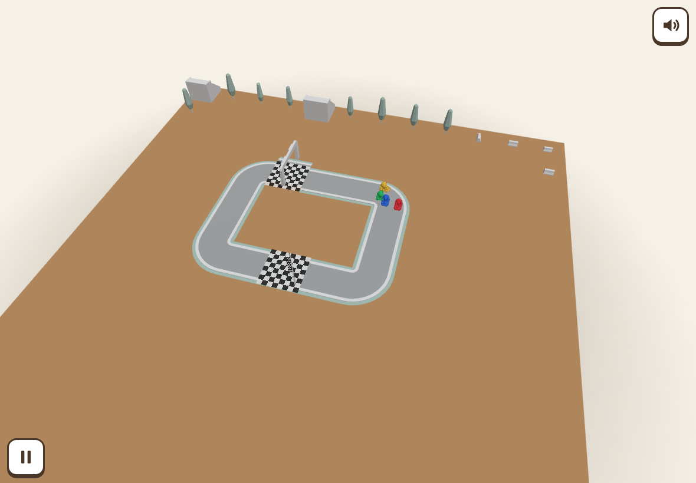
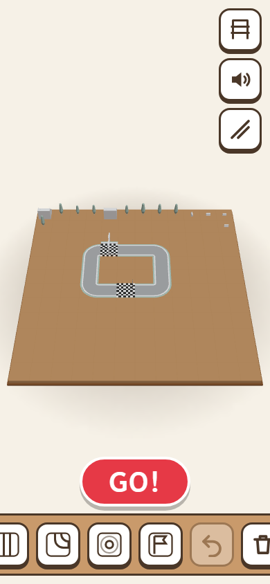

# Race-It

[](https://github.com/mansyar/race-it/actions/workflows/ci.yml)

A wordless 3D racing toy for preschoolers (ages 3–5): build a little track, pick colorful karts, and watch them race around the wooden table. Installable, offline-first, and operable without reading a single word.





## The game

Race-It is a fixed-camera toy diorama with one happy loop:

**Build → Pick cars → Race → Celebrate → Race again**

- **Build** — tap a piece in the palette, tap a grid cell to place it; tap a placed piece to rotate it. Close the loop and the big GO button lights up. Undo and remove are one tap away.
- **Pick cars** — choose 2–4 karts; no reading required.
- **Race** — a traffic-light countdown, then karts race on their own for one lap (~30–45 s), with the camera following the closest battle. Races are tuned for close, photo-worthy finishes.
- **Celebrate** — confetti, a victory spin, and a giant RACE AGAIN button — or tap the track icon to build again.
- **Shelf** — up to 12 tracks are auto-saved (long-press a saved track to delete it).

The UI is entirely icon-based (the only word in the app is the winner's color after a race), with ≥64 px touch targets for small hands. Sound and mute live in the corner.

## Tech stack

Vanilla **TypeScript** + **Three.js** — no framework, no game engine.

- [Vite](https://vite.dev) for dev/build, [vite-plugin-pwa](https://vite-pwa-org.netlify.app) for the offline-first service worker
- [Vitest](https://vitest.dev) for unit tests, [Playwright](https://playwright.dev) for end-to-end tests
- [Biome](https://biomejs.dev) for linting/formatting
- Kenney CC0 art & audio — see [Credits](#credits)

## Development

Requires **Node 24** (`.nvmrc`) and pnpm (via corepack):

```bash
corepack enable
pnpm install
pnpm dev
```

| Command | Purpose |
| --- | --- |
| `pnpm dev` | Vite dev server |
| `pnpm test` | Unit tests (Vitest) |
| `pnpm test:coverage` | Unit tests + coverage (CI gate: ≥80%) |
| `pnpm lint` | Biome check |
| `pnpm format` | Biome format |
| `pnpm build` | Type-check (`tsc --noEmit`) + production build |
| `pnpm preview` | Preview the production build |
| `pnpm exec playwright test` | End-to-end suite (Chromium; first run: `pnpm exec playwright install chromium`) |
| `pnpm capture:screenshots` | Regenerate `public/screenshots/` from the production build |

Developer URL flags: `?race` (seeded headless race), `?perf` (performance harness), `?debug` (state dumps), `?tier=high|mid|low` (force render quality).

## Testing & CI

GitHub Actions (`ci.yml`) runs on every push and pull request: Biome, unit tests with an 80% coverage gate, type-check + build, and the Playwright suite including a PWA installability check.

## Deployment

The app is a static PWA served from a container:

- `Dockerfile` builds the Vite output and serves it with nginx (`nginx.conf`).
- Pushing a `v*` tag triggers `release.yml`: build → push `ghcr.io/mansyar/race-it:<tag>` + `:latest` → publish GitHub Release notes → trigger the Coolify deploy webhook.

## Project structure

```
conductor/   Spec-driven development docs (product, tech stack, tracks, workflow)
src/         App source (grid, render, race, presentation, audio, ui, assets)
e2e/         Playwright specifications
public/      PWA icons, splash screens, screenshots
scripts/     Tooling (screenshot capture, GLB measurement, junction probes)
```

Development follows the Conductor spec-driven workflow — see `conductor/workflow.md`.

## Credits

Bundled assets are CC0 from [Kenney](https://kenney.nl):

- **Racing Kit** — road pieces, start/finish flag, barrier, grandstand, tree (`src/assets/models/LICENSE-kenney-racing-kit.txt`)
- **Car Kit** — the four karts (`src/assets/models/LICENSE-kenney-car-kit.txt`)
- **Interface Sounds** — UI & game sound effects (`src/assets/sfx/LICENSE-kenney-interface-sounds.txt`)
- **Music Jingles** — victory jingle (`src/assets/sfx/LICENSE-kenney-music-jingles.txt`)
- **Music Loops** — race soundtrack (`src/assets/audio/LICENSE-kenney-music-loops.txt`)
